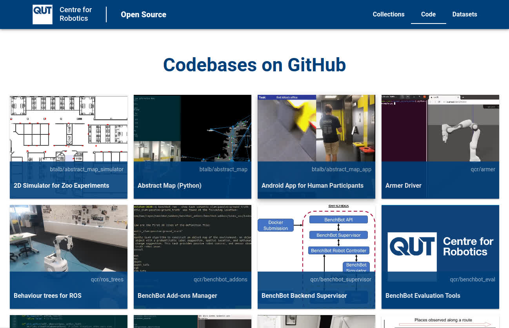

# QCR Open Source Website

This repository holds the QCR open source website; a central place where the [QUT Centre for Robotics](https://research.qut.edu.au/qcr/) lists its code and datasets for the community.

## Documentation

TODO update link below with stable link when they exist

All documentation has moved internally to our [technical documentation site](https://docs.qcr.ai).
