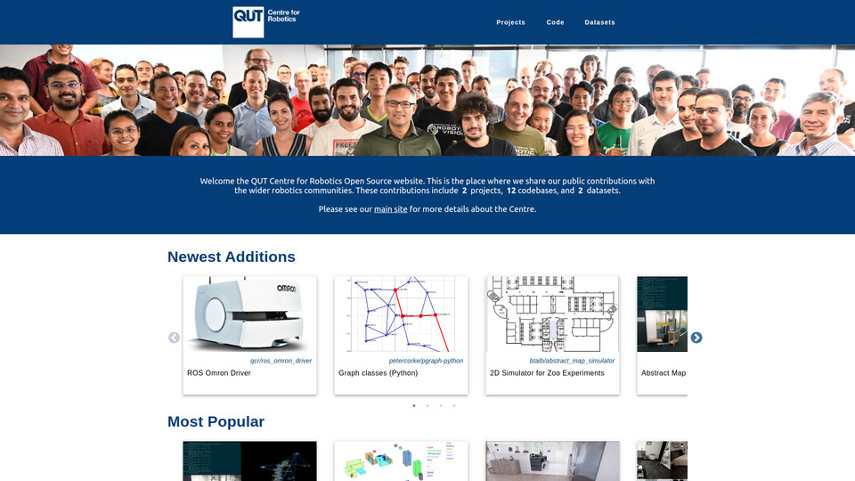

# QCR Open Source Website

[](https://qcr.github.io)



This repository holds the QCR open source website; a central place where the [QUT Centre for Robotics](https://research.qut.edu.au/qcr/) lists its code and datasets for the community.

The site makes it easy for members of QCR (and affiliated members) to share projects with the community under the QCR banner. In turn, we hope the community can grow to identify this as a go-to place for novel state-of-the-art open source robotics software and datasets.

The website is _content-driven_: provide some content describing your cool stuff, and we produce a website to show it off for you.

_Content_ is simply a Markdown file with some [front-matter](https://github.com/jxson/front-matter) settings for how you want your content displayed. See [below](#content-settings-specification) for a full outline of supported content settings.

## Quickstart

Here's some common things you may wish to do, and how to do them within the website:

### Quickly add a GitHub repository / dataset / collection to the website

For example, the following would make [https://github.com/btalb/abstract_map](https://github.com/btalb/abstract_map) available at `https://qcr.github.io/code/my-repo`:

1. Create a file called `my-repo.md` in the `./content/` directory with the following contents:
   ```markdown
   ---
   name: The Abstract Map
   type: code
   url: https://github.com/btalb/abstract_map
   ---
   ```
2. Commit the changes, & push them to the `master` branch
3. Wait until all [pending actions](https://github.com/qcr/qcr.github.io/actions) are complete (these are rebuilding the site with the new content)

That's it. The repository should now be on the site, with the first image used as the feature image in cards and the content of its `README.md` file displayed on the `https://qcr.github.io/code/my-repo` page. See the [content settings specification](#content-settings-specification) for details on how to add other types of content for the site, or look at some of the many live examples in the `./content/` directory of this repository.

### Adding content to the site the proper way

The previous method is a painful way to develop. You add content, blindly commit on `master`, and cross your fingers while it builds. Then painstakingly rinse and repeat until you get it working as desired.

Instead, it's much better to add content locally & push it up to the main site when you're happy with your additions. To do this, you need to make sure you have NodeJs (latest LTS), ffmpeg, & Git:

```
sudo apt install nodejs npm ffmpeg git
sudo npm --global install n
sudo n lts
```

Then clone this repo, & install the website's NodeJs dependencies:

```
git clone https://github.com/qcr/qcr.github.io && cd qcr.github.io
npm install
```

You're now good to go. Start the development server by running the following in a terminal:

```
npm run dev
```

Go to [http://localhost:3000](http://localhost:3000) in your browser, and you should see the website running locally on your machine. The development server will take a long time to display the first page, as it gathers the latest data from each linked repository into a local cache, and runs site resources through loaders.

Content can now be added to the site like done above, but you can the changes locally before pushing them. Other notes about the development server:

- the repository cache is stored at `/var/tmp/qcr-site/` by default. You can change this via the `REPO_CACHE` environment variable (i.e. `REPO_CACHE=/some/other/location npm run dev`)
- most changes shouldn't require you to touch the development server again once it is running
- that being said, some more complicated changes may require a manual page refresh, or in rare cases a restart of the development server

Want to be really sure your changes will successfully build? You can build the entire site locally by running:

```
npm run build
```

And then run the built site with your favourite simple HTTP server, e.g.:

```
python3 -m http.server --directory .next-out
```

### Automatically update the site whenever I update my code's README

**_Note: you need to be a member of the [QCR GitHub organisation](https://github.com/qcr) or have access to the internal [QUT Robotics Wiki](https://wiki.qut.edu.au/display/cyphy/QUT+Centre+for+Robotics) for these steps_**

It is annoying to manually update the site every time you make changes to your README in your `code` repository. Instead, you can add a [GitHub Action](https://github.com/features/actions) to your repository to remotely request rebuilding of this site when you push to `master` in your repository. To do this:

1. Copy [this action file](https://github.com/qcr/tools/raw/develop/github_actions/trigger_site_update.yaml) into the `.github/workflows/` directory of your code repository
2. Edit the YAML payload in the `env` section of the action file to match your desired settings (as a minimum all you have to do is set a `'name'`!)
3. Push the changes to `master`
4. The `trigger_site_update` action needs a token to request the site update remotely. The token is provided via [encrypted secrets](https://docs.github.com/en/free-pro-team@latest/actions/reference/encrypted-secrets). An organisation secret provides the token if your repository is owned by `qcr` (i.e. has a URL of the form `https://github.com/qcr/*`), otherwise follow the steps documented [here](https://wiki.qut.edu.au/display/cyphy/Shared+account+for+QCR+members) (private to QCR members) to add the token as a secret to your repository.

Done. Now whenever you edit the corresponding Markdown content (or any image files) a site rebuild will be triggered here.

_(a separate content entry is created from this process; you need to ensure you delete any manually added `code` content entries here or you will probably get duplicate content errors)_

### Showing your QCR affiliation on your repository

[Shield Badges](https://github.com/badges/shields) at the top of your `README.md` are a great way to do this (see the top of this `README.md` for a demo). To add a QCR badge to your repository that links to this site, add the following below your title in your `README.md`:

```markdown
[](https://qcr.github.io)
```

Alternatively, if you want to have a set of badges that are centred you can use raw HTML tags:

```markdown
<p align="center">
  <a href="https://qcr.github.io" alt="QUT Centre for Robotics Open Source"></a>
</p>
```

_(as a reference, the current badge was generated [here](https://shields.io/) with #00407a used as the colour)_

## Content Settings Specification

Settings for your content are provided in a 'fenced' [front-matter](https://github.com/jxson/front-matter) block at the start of a Markdown file. The syntax inside the fenced block is YAML. For example:

```markdown
---
name: Collection of my research
type: collection
id: awesome-research
image_position: 50% 100%
---

# Heading

The rest of my markdown...
```

As the above example shows, settings are a set of named keys with a corresponding values. The full list of supported keys, when they're required, and their description are as follows:

| Key              | Description                                                                                                                                                                                                                                                                                                                                                                                                                                                                                                                        |
| ---------------- | ---------------------------------------------------------------------------------------------------------------------------------------------------------------------------------------------------------------------------------------------------------------------------------------------------------------------------------------------------------------------------------------------------------------------------------------------------------------------------------------------------------------------------------- |
| `name`           | (required)<br>The name given to your content which will appear in cards & on the page title                                                                                                                                                                                                                                                                                                                                                                                                                                        |
| `type`           | (required)<br>The type of your content (must be one of `code`, `dataset`, or `collection`)                                                                                                                                                                                                                                                                                                                                                                                                                                         |
| `url`            | (required unless `type == 'collection'`)<br>A URL associated with your content Will usually be a single URL as a string (i.e. the URL for the code's GitHub repository, the download link for a dataset, or an external website for your collection), but could also be a list of strings when `url_type == 'list'`.                                                                                                                                                                                                               |
| `url_type`       | (only used when `type == 'dataset'`)<br>Accepts one of 3 options describing the type of URL provided for a dataset: `normal` for standard a download URL, `list` for a list of download URLs, or `external` for a single URL pointing to the dataset's external site. When using `list`, `url` should contain a YAML list with keys `name`, `url`, and `size`.                                                                                                                                                                     |
| `id`             | (optional)<br>The ID for this piece of content that is used throughout the site, including in the URL (i.e. a `collection` with `id` `'awesome-research'` will be available at `https://qcr.github.io/collection/awesome-research`). Is pulled from the filename of this file without the extension if not provided. An error is thrown if there are duplicate ID & type pairs (e.g. there can be both a `collection` and `code` with `id` `'benchbot'`, but not two collections with the `'benchbot'` `id`).                      |
| `content`        | (optional)<br>Render this Markdown file for your content _instead_ of what follows in the current file. This is particularly useful for `code` content that wants to use a file like `repo.md` from its GitHub repository. To do this, set `content` to `repo:/repo.md`<sup>**1**</sup>. Rendered content is the first hit in this list:<ol><li>Value provided for this key<li>Markdown following front-matter in this file<li>`repo:/README.md` if type is `code`<li>Error is raised as we couldn't find any usable content!</ol> |
| `image`          | (optional)<br>Image to use as the feature image on the content's card throughout the site. The chosen feature image is the first hit in this list:<ol><li>Value provided for this key<li>First _non-svg_ image in the Markdown content with a _local_ `src` (i.e. not `https://...`)<li>The [default fallback image](https://github.com/qcr/qcr.github.io/raw/master/assets/qcr_logo_light_filled.png)                                                                                                                             |
| `image_position` | (optional)<br>Uses the CSS [object-position](https://developer.mozilla.org/en-US/docs/Web/CSS/object-position) property to specify feature image position in the card. For example, `center 100%` focuses on the bottom half of an image, `center 0%` on the top half, `0% center` on the left half, and `center` or `center center` on the centre of the image. The default value is `center`.                                                                                                                                    |
| `image_fit`      | (optional)<br>Uses the CSS [object-fit](https://developer.mozilla.org/en-US/docs/Web/CSS/object-fit) property to specify feature image fitting method in the card. The default is `cover`, but you may want to change this to `contain`.                                                                                                                                                                                                                                                                                           |
| `size`           | (optional, only valid when `type == dataset`)<br>A string denoting the size of the dataset (is shown in dataset cards).                                                                                                                                                                                                                                                                                                                                                                                                            |
| `code`           | (optional, only valid when `type == 'collection'`)<br>A list of IDs denoting the `code` content that is a part of this collection.                                                                                                                                                                                                                                                                                                                                                                                                 |
| `datasets`       | (optional, only valid when `type == 'collection'`)<br>A list of IDs denoting the `dataset` content that is a part of this collection.                                                                                                                                                                                                                                                                                                                                                                                              |
| `feature`        | (optional, only valid when `type == 'collection'`)<br>An integer value. Used to add this collection to the "Featured Collections" list on the main page. The list is in descending order based on the value of these `feature` keys.                                                                                                                                                                                                                                                                                               |

<sup>**1**</sup> We enable a special URI across this website for specifying files from another _GitHub_ repository. The full URI syntax is `repo:<repo_username>/<repo_name>/<path_to_file>`. For example, the URI `repo:btalb/abstract_map/docs/project_outline.png` requests the `docs/project_outline.png` file from the `https://github.com/btalb/abstract_map` repository. In cases where we can infer repository URL from surrounding context (like in all of the setting keys described above), a minimal URI can be used: `repo:/<path_to_file>`. In the previous example, `repo:/docs/project_outline.png` could be used assuming the `url` key was set to `https://github.com/btalb/abstract_map`.

## Technical Details

Odds and ends that may be useful.

### Markdown specification

We use [markdown-it](https://github.com/markdown-it/markdown-it) for parsing and rendering markdown, with a few helpful extensions. All syntax from [GitHub Flavored Markdown](https://github.github.com/gfm/) is supported, with the following additions:

- Videos from sources like YouTube can be embedded with a single line (see [markdown-it-block-embed](https://github.com/rotorz/markdown-it-block-embed)):

```markdown
@[youtube](https://www.youtube.com/watch?v=jQPkV29KFvI)
```

- Don't worry about converting GIFs from your GitHub Markdown into videos for the website. All GIFs are automatically optimised into WEBM videos with a cover photo in the build process.
