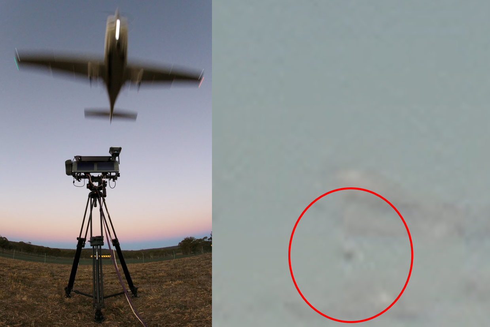

A dataset of stationary, fixed-wing aircraft on a collision course for vision-based sense and avoid.

The dataset consists of 15 uncompressed, high-resolution image sequences containing 55,521 images of a fixed-wing aircraft approaching a stationary, grounded camera.

Ground truth labels and videos of the image sequences are also provided.

