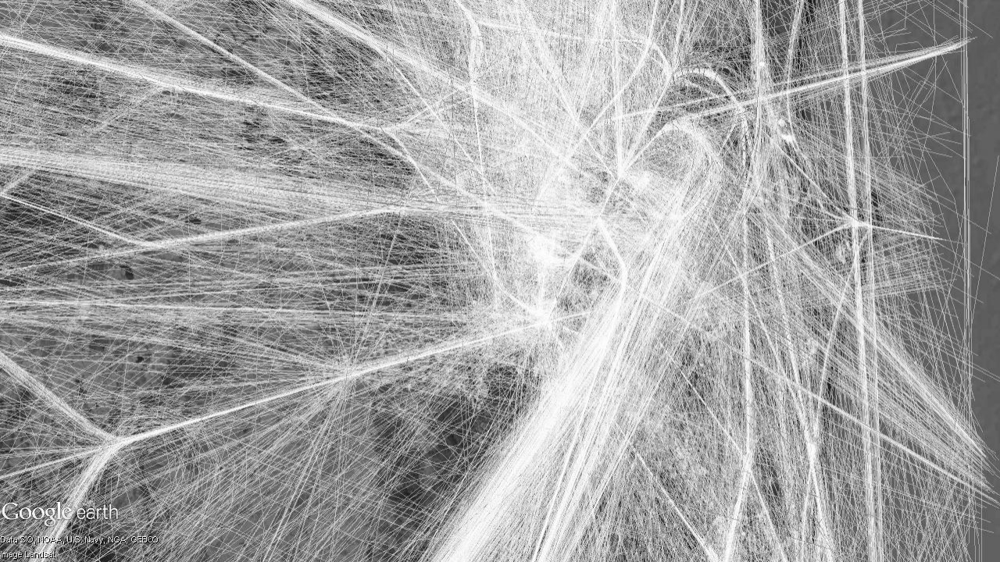

A dataset of aircraft operating around an airport and efficient implementation of an optimal quickest change detection rule to detect changes in airspace traffic.

The raw data is supplied by Airservices Australia and consists of merged track surveillance data acquired from ADS-B and Radar for aircraft operating around an airport. The data was processed to extract the aircraft patterns on a grid at certain sampling points, and aircraft count information used to identify busy and quiet traffic environments. The aircraft pattern and traffic environment class is made available in this dataset.
