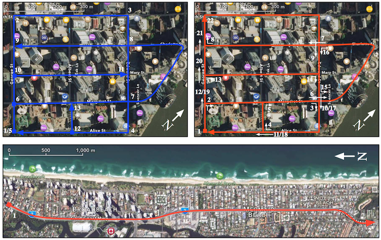

Paper is currently in press and expected to be published in 2016. Please cite the following paper if you use these datasets (use the correct year after it has been published):

Pepperell, E., Corke, P. & Milford, M. (in press). Routed Roads: Probabilistic Vision-Based Place Recognition for Changing Conditions, Split Streets and Varied Viewpoints. _The International Journal of Robotics Research (IJRR)_.

Links to datasets can be found through the download button above.
