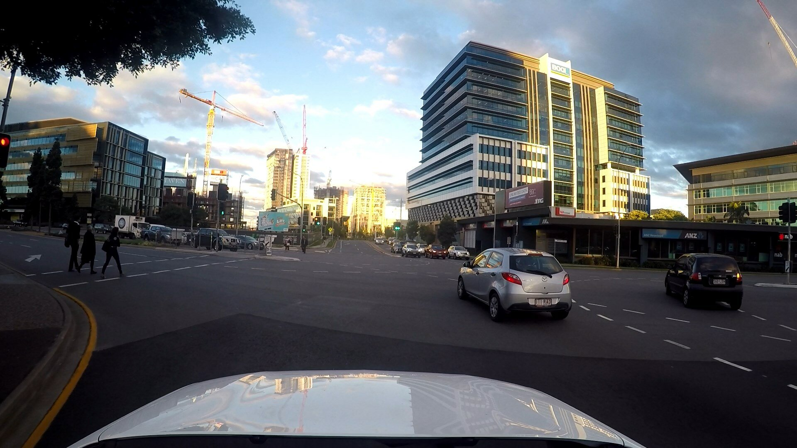
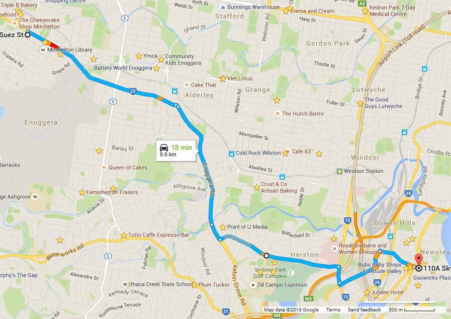

**Description:**

GoPro vision-only dataset gathered on a late afternoon / evening approximately 10 km drive (one way) into and out of the Brisbane metropolitan area. Lots of varied traffic and interesting pedestrian situations. Map shows inbound route (part 1), return route (part 2) is approximately in reverse but has some extra suburban streets at the end.

Settings: 1080p 30 fps wide FOV setting on a GoPro 4 Silver.

Download links for both parts can be accessed via the button above.

**Paper reference:**

If you use this dataset, please cite the below paper:

Michael Milford, Chunhua Shen, Stephanie Lowry, Niko Suenderhauf, Sareh Shirazi, Guosheng Lin, Fayao Liu, Edward Pepperell, Cesar Lerma, Ben Upcroft, Ian Reid, "Sequence Searching With Deep-Learnt Depth for Condition- and Viewpoint-Invariant Route-Based Place Recognition", in The IEEE Conference on Computer Vision and Pattern Recognition (CVPR) Workshops, 2015, pp. 18-25.

Paper web link:

[http://www.cv-foundation.org/openaccess/content_cvpr_workshops_2015/W11/html/Milford_Sequence_Searching_With_2015_CVPR_paper.html](http://www.cv-foundation.org/openaccess/content_cvpr_workshops_2015/W11/html/Milford_Sequence_Searching_With_2015_CVPR_paper.html)
