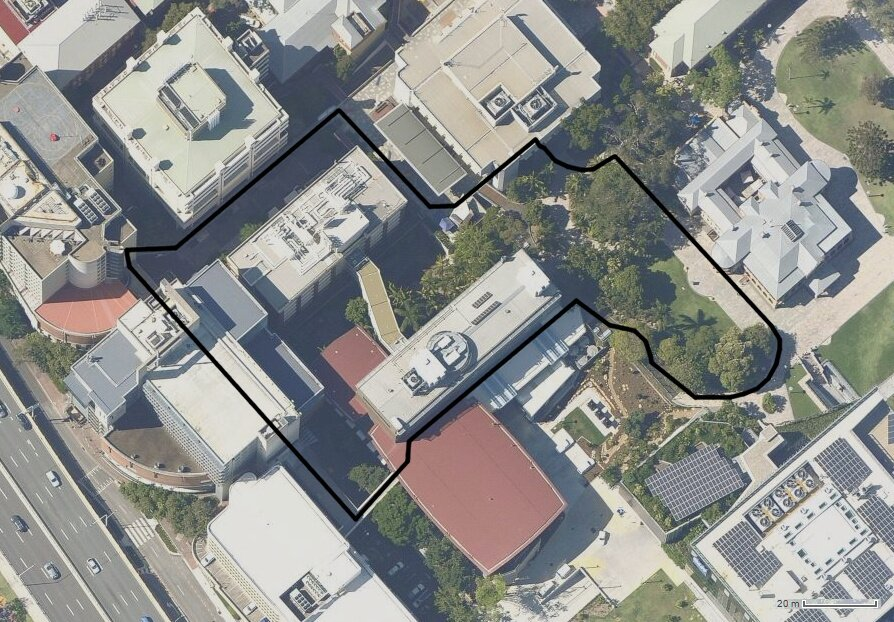

Two vision datasets of a single route through the Gardens Point Campus, Queensland University of Technology and along the Brisbane River, Brisbane, Australia. One route is traversed on the left-hand side of the path during the day and the other day route is traversed on the right-hand side of the path during the night, to capture both pose and condition change.

Full details of how to use the dataset and individual download links are available from:

[https://wiki.qut.edu.au/pages/viewpage.action?pageId=175739622](https://wiki.qut.edu.au/pages/viewpage.action?pageId=175739622)
