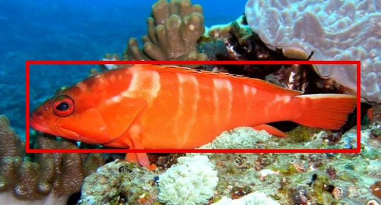

This fish dataset currently consisting of 3,960 images collected from 468 species. This data consists of real-world images of fish captured in conditions defined as "controlled", "out-of-the-water" and "in-situ". The "controlled", images consists of fish specimens, with their fins spread, taken against a constant background with controlled illumination. The "in-situ" images are underwater images of fish in their natural habitat and so there is no control over background or illumination. The "out-of-the-water" images consist of fish specimens, taken out of the water with a varying background and limited control over the illumination conditions. A tight red bounding box is annotated around the fish.

Full details of how to use the dataset and individual download links are available from:

[https://wiki.qut.edu.au/display/cyphy/Fish+Dataset](https://wiki.qut.edu.au/display/cyphy/Fish+Dataset)
