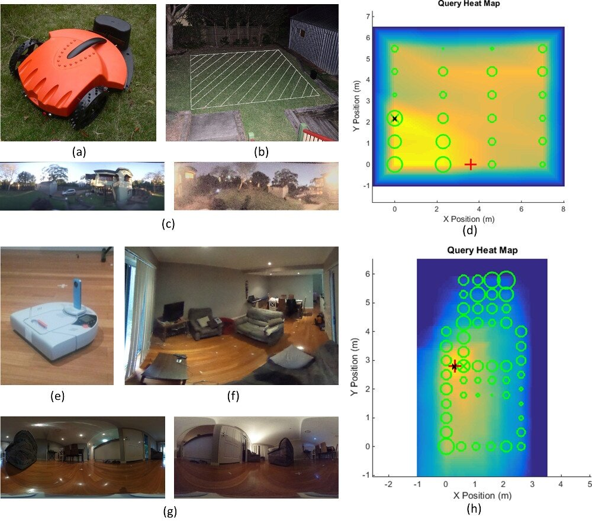

Vision datasets gathered within a townhouse (Indooroopilly, Brisbane), and a suburban backyard (Gaythorne, Brisbane) in varying conditions over the same area: one set during the day, and one during night time. The dataset includes the all the extracted frames, as well as a text document containing their ground truthed locations. The dataset was used in a paper that is accepted to ICRA2016:

J. Mount, M. Milford, "2D Vision Place Recognition for Domestic Service Robots at Night", in IEEE International Conference on Robotics and Automation, Stockholm, Sweden, 2016.

The code used to compare images and perform place recognition is also contained within the files.

If you use this dataset, or the provided code, please cite the above paper.
