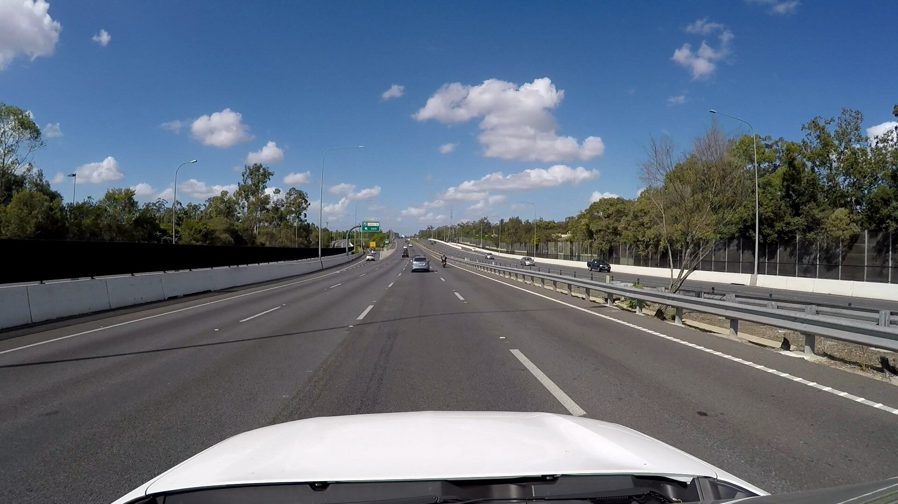
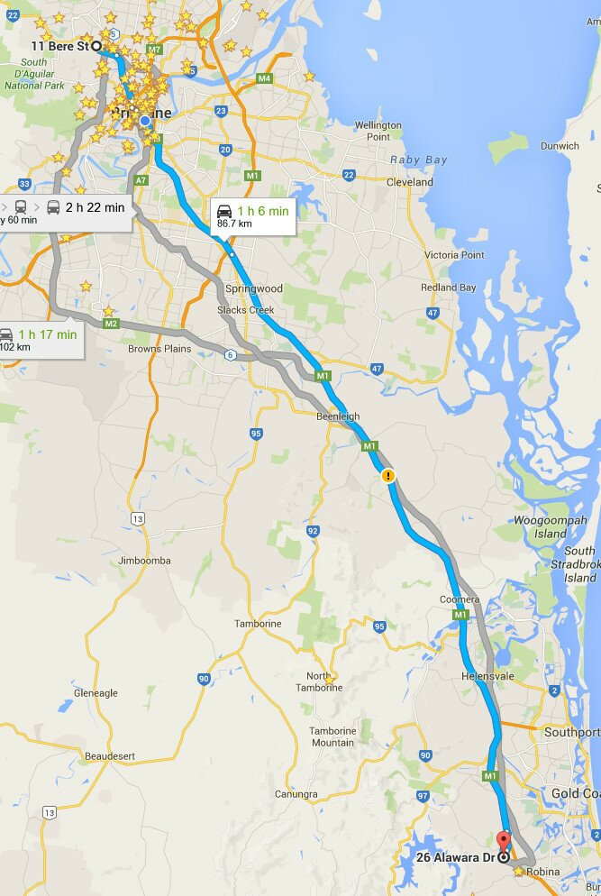

**Description:**

GoPro vision-only dataset gathered along an approximately 87 km drive from Brisbane to the Gold Coast, in sunny weather (no ground truth but a reference trajectory provided in the image on the left. Lots of varied traffic conditions, some interesting pedestrian and dangerous driving situations captured on the camera.

Settings: 1080p 30 fps wide FOV setting on a GoPro 4 Silver .

Download links are available through the button above for:

- the full video,
- a highly compressed version, and
- a short sample segment.

**Paper reference:**

If you use this dataset, please cite the below paper:

Michael Milford, Chunhua Shen, Stephanie Lowry, Niko Suenderhauf, Sareh Shirazi, Guosheng Lin, Fayao Liu, Edward Pepperell, Cesar Lerma, Ben Upcroft, Ian Reid, "Sequence Searching With Deep-Learnt Depth for Condition- and Viewpoint-Invariant Route-Based Place Recognition", in The IEEE Conference on Computer Vision and Pattern Recognition (CVPR) Workshops, 2015, pp. 18-25.

Paper web link:

[http://www.cv-foundation.org/openaccess/content_cvpr_workshops_2015/W11/html/Milford_Sequence_Searching_With_2015_CVPR_paper.html](http://www.cv-foundation.org/openaccess/content_cvpr_workshops_2015/W11/html/Milford_Sequence_Searching_With_2015_CVPR_paper.html)
