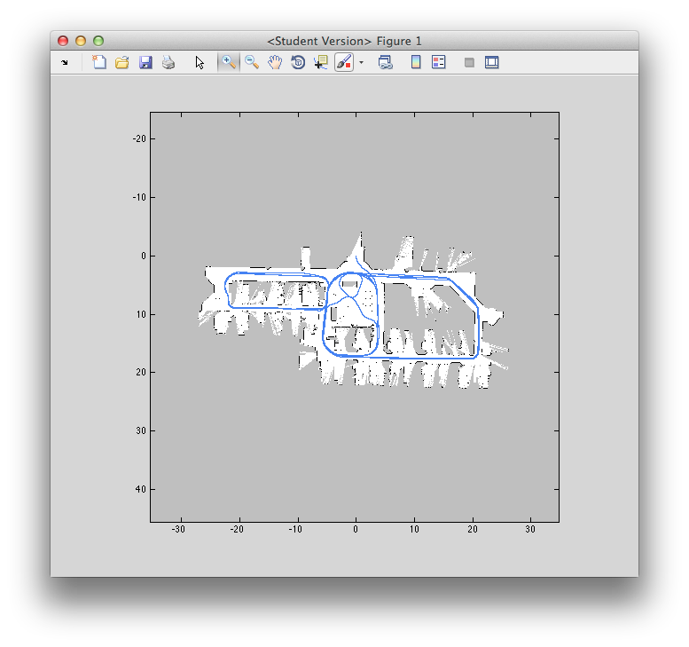

A vision dataset was taken on level 7 of S-Block QUT Gardens Point campus. The data contains stereo images, laser data and wheel odometry in addition to secondary data such as camera calibrations and transforms between sensors. This data was collected over a single continuous run over the level with the Guiabot platform under manual control.

Full details of how to use the dataset and individual download links are available from:

[https://wiki.qut.edu.au/display/cyphy/Indoor+Level+7+S-Block+Dataset](https://wiki.qut.edu.au/display/cyphy/Indoor+Level+7+S-Block+Dataset)
