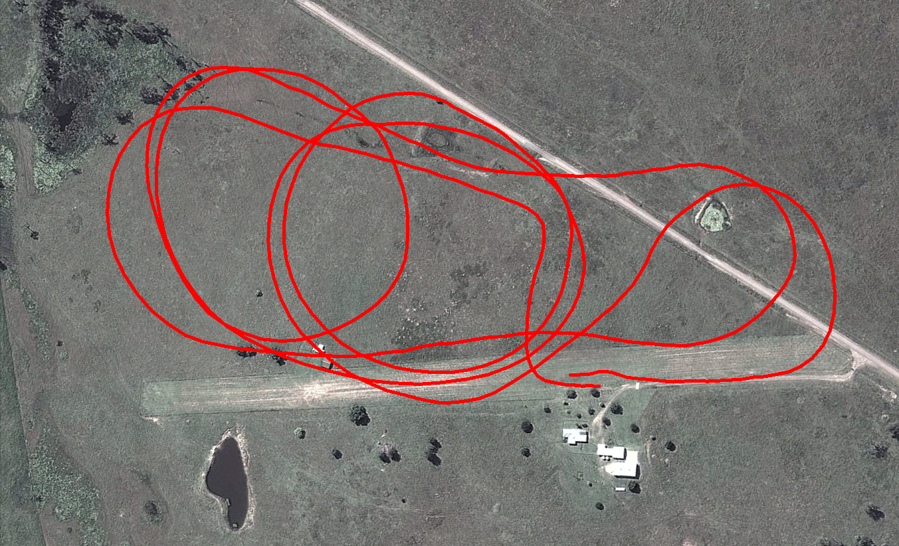

A vision dataset gathered from a radio-controlled aircraft flown at Kagaru, Queensland, Australia on 31/08/10. The data consists of visual data from a pair of downward facing cameras, translation and orientation information as a ground truth from an XSens Mti-g INS/GPS and additional information from a USB NMEA GPS. The dataset traverses over farmland and includes views of grass, an air-strip, roads, trees, ponds, parked aircraft and buildings.

Please see the author's page for up-to-date details and documentation on the dataset:

[https://michaelwarren.info/docs/datasets/kagaru-airborne-stereo/](https://michaelwarren.info/docs/datasets/kagaru-airborne-stereo/)
