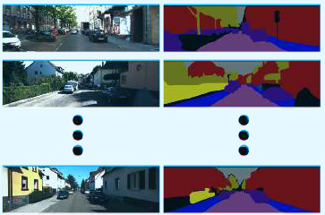

Dataset contains 41 original KITTI images and the corresponding manually semantically labelled data. The labelled data is in the form of a Matlab .mat file with each entry in the array corresponding to the class label.

Full details of how to use the dataset and individual download links are available from:

[https://wiki.qut.edu.au/display/cyphy/KITTI+Semantic+Labels](https://wiki.qut.edu.au/display/cyphy/KITTI+Semantic+Labels)
