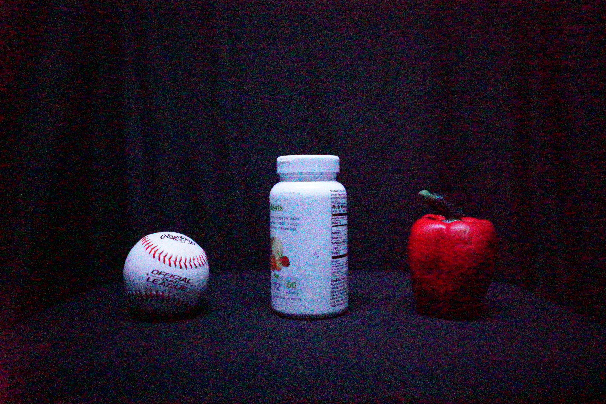

For 28 objects (22 within the ImageNet class set and 6 within the PASCAL VOC class set), a set of raw images (DNG format) has been obtained at a variety of lighting conditions (1-40lx), ISO settings (3200 - 409600) and exposure times (1/8000 - 1/10) for comparison of the influence of demosaicing techniques on feature point detectors and CNNs at low-light and with noise. Each object set has a reference image captured at ~380lx. All images were captured with a Sony α7s in a dark room with controlled lighting.

Presented in:

[D. Richards, J. Sergeant, M. Milford, P. Corke, "Seeing in the Dark: the Demosaicing Difference", IEEE Conference on Computer Vision and Pattern Recognition [under review], 2017.](https://www.dropbox.com/s/d3sasg58yrjm071/Seeing%20in%20the%20Dark%20-%20the%20Demosaicing%20Difference.pdf?dl=0)
