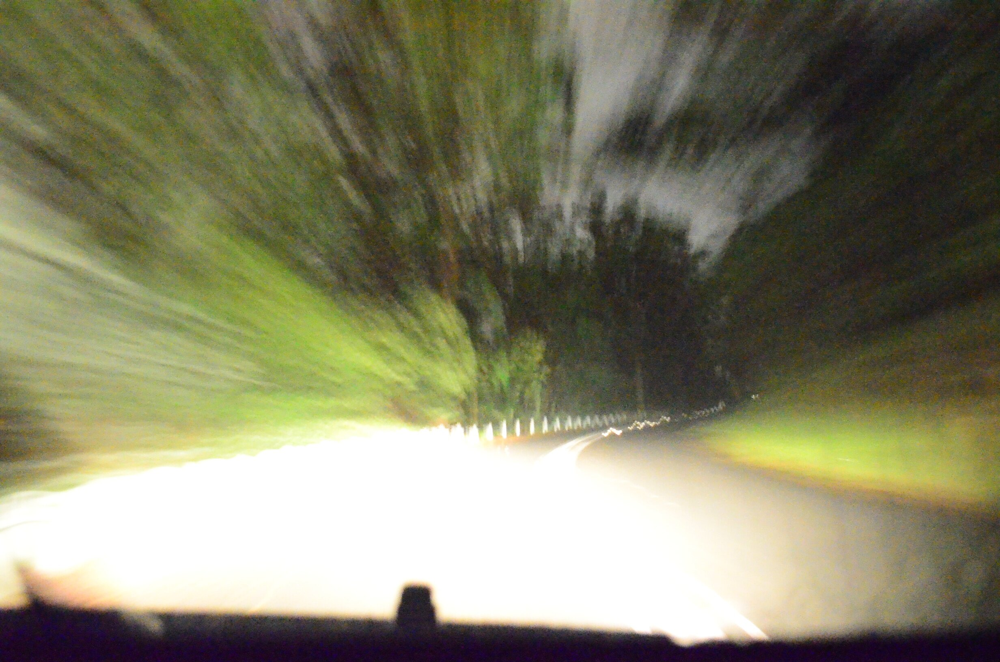

**Description:**

Mt Cootha circuit day and night time laps with a Sony A7s camera (note this is a later dataset, not the original in the paper below).

The original datasets for this paper were recorded using a Nikon D5100 with long exposures.

Download links for all of the datasets can be accessed using the button above.

**Paper reference:**

If you use this dataset, please cite the below paper:

Milford, Michael, Turner, Ian, & Corke, Peter (2013) Long exposure localization in darkness using consumer cameras. In Vincze, M (Ed.) Proceedings of the 2013 IEEE International Conference on Robotics and Automation (ICRA). Institute of Electrical and Electronic Engineers (IEEE), United States, pp. 3755-3761.
