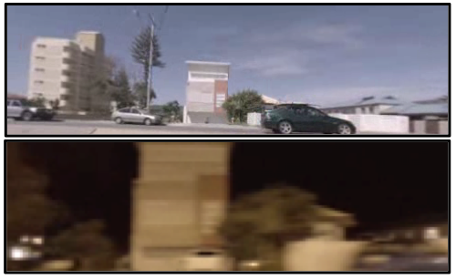

We provide two vehicular datasets, acquired in Queensland, Australia, each consisting of multiple passes in different lanes across day and night on approximately 4 km, 4-lane, bidirectional road sections, divided by median strips. The first dataset was collected along the Gold Coast Highway in Palm Beach ("highway") and the second was collected along Christine Avenue in Robina and nearby suburbs ("suburban").

The dataset can be downloaded using the button above, with further information contained in the `Readme.txt`.
