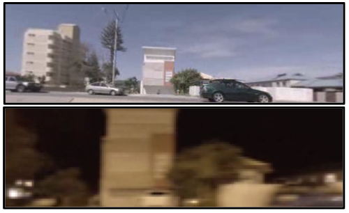

**Presented with the permission of NASA's Jet Propulsion Laboratory (JPL) in:**

[J. Sergeant, G. Doran, D. R. Thompson, C. Lehnert, A. Allwood, B. Upcroft, M. Milford, "Towards Multimodal and Condition-Invariant Vision-based Registration for Robot Positioning on Changing Surfaces," Proceedings of the Australasian Conference on Robotics and Automation, 2016.](https://www.dropbox.com/s/jures6u20q9yvjn/Towards%20Multimodal%20and%20Condition-Invariant%20Vision-based%20Registration%20for%20Robot%20Positioning%20on%20Changing%20Surfaces.pdf?dl=0)

**Further referenced in:**

[J. Sergeant, G. Doran, D. R. Thompson, C. Lehnert, A. Allwood, B. Upcroft, M. Milford, "Appearance-Invariant Surface Registration for Robot Positioning," International Conference on Robotics and Automation 2017, 2017.](https://www.dropbox.com/s/wnre3ioyrpz7n24/Appearance-Invariant%20Surface%20Registration%20for%20Robot%20Positioning.pdf?dl=0)

**Associated code for the above papers can be obtained at the following repository:**

[https://github.com/jamessergeant/seqreg_tpp.git](https://github.com/jamessergeant/seqreg_tpp.git)
