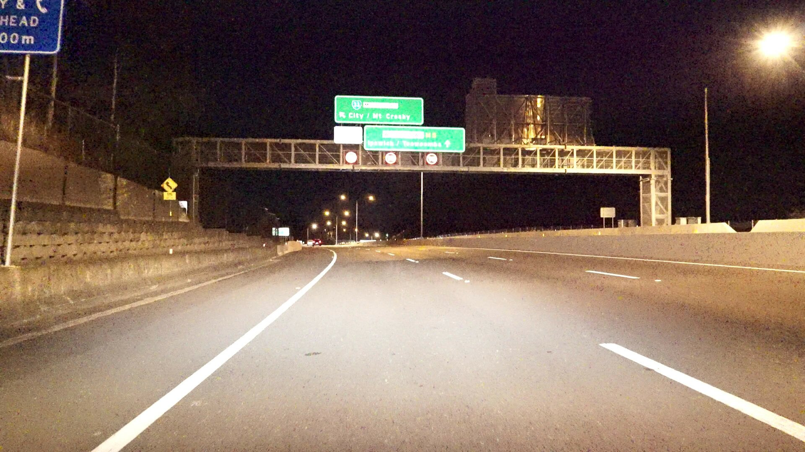
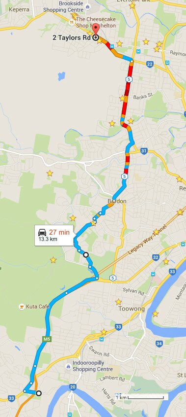

**Description:**

Night time ~13 km drive with Sony A7s camera mounted on the roof in Brisbane. Mixture of highway and suburban driving, some light traffic and stop go at traffic lights.

Settings: 1080p 25 fps.

Download links for both the full video and a highly compressed version are available through the button above.

**Paper reference:**

If you use this dataset, please cite the below paper:

Michael Milford, Chunhua Shen, Stephanie Lowry, Niko Suenderhauf, Sareh Shirazi, Guosheng Lin, Fayao Liu, Edward Pepperell, Cesar Lerma, Ben Upcroft, Ian Reid, "Sequence Searching With Deep-Learnt Depth for Condition- and Viewpoint-Invariant Route-Based Place Recognition", in The IEEE Conference on Computer Vision and Pattern Recognition (CVPR) Workshops, 2015, pp. 18-25.

Paper web link:

[http://www.cv-foundation.org/openaccess/content_cvpr_workshops_2015/W11/html/Milford_Sequence_Searching_With_2015_CVPR_paper.html](http://www.cv-foundation.org/openaccess/content_cvpr_workshops_2015/W11/html/Milford_Sequence_Searching_With_2015_CVPR_paper.html)
