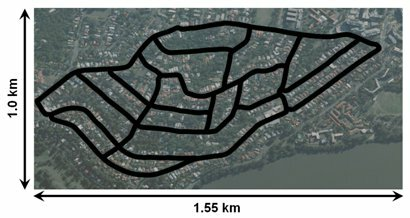

A vision dataset of a single route through the suburb of St Lucia, Queensland, Australia. The visual data was collected with a forward facing webcam attached to the roof of a car. The route was traversed at five different times during the day to capture the difference in appearance between early morning and late afternoon. The route was traversed again, another five times, two weeks later for a total of ten datasets. GPS data is included for each dataset.

Full details of how to use the dataset and individual download links are available from:

[https://wiki.qut.edu.au/display/cyphy/St+Lucia+Multiple+Times+of+Day](https://wiki.qut.edu.au/display/cyphy/St+Lucia+Multiple+Times+of+Day)
