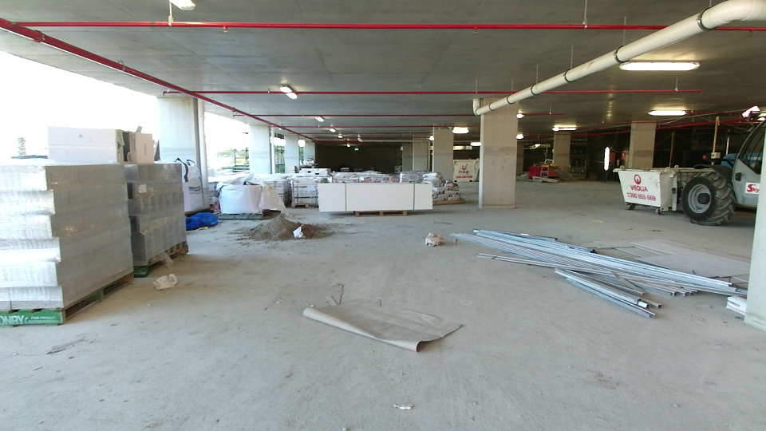

Contains RGB, Depth and HHA images of a Construction Site with the trip hazards labelled.

The dataset spans 2'000m2 of construction site over four floors, contains ~629 trip hazards.

Presented in paper under review:

McMahon, S., Sϋnderhauf, N., Upcroft, B & Milford, M. (2017). Trip Hazard Detection On Construction Sites Using Colour and Depth Information. Submitted to International Conference on Intelligent Robotics and Systems (IROS) with RAL option 2017
