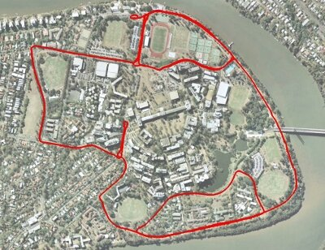

A vision dataset gathered from a car driven in a 9.5km circuit around the University of Queensland's St Lucia campus on 15/12/10. The data consists of visual data from a calibrated stereo pair, translation and orientation information as a ground truth from an XSens Mti-g INS/GPS and additional information from a USB NMEA GPS. The dataset traverses local roads and encounters a number of varying scenarios including roadworks, speed bumps, bright scenes, dark scenes, reverse traverses, a number of loop closure events, multi-lane roads, roundabouts and speeds of up to 60 km/h.

Please see the author's page for up-to-date details and documentation on the dataset:

[https://michaelwarren.info/docs/datasets/uq-st-lucia-stereo-dataset/](https://michaelwarren.info/docs/datasets/uq-st-lucia-stereo-dataset/)
