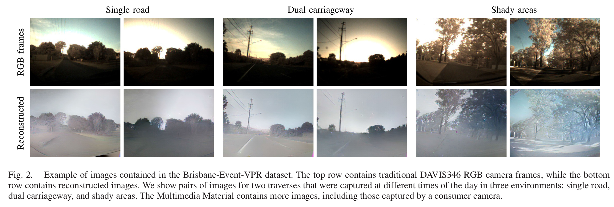

Brisbane-Event-VPR was captured in the Brookfield and Kenmore Hills outer suburbs of Brisbane. The route is approx. 8km long and contains a variety of different roads, ranging from single-lane roads without much build-up over dual carriageways to built-up areas. Some areas contain many trees that cast shadows on the street and lead to challenging lighting conditions. The dataset includes 6 traverses recorded at different times of the day and under varying weather conditions. A DAVIS346 event camera was used to record the dataset; it was mounted forward-facing on the inside of the windshield of a Honda Civic. The DAVIS346 allows recording of events and aligned RGB frames with 346x260 pixels resolution.

